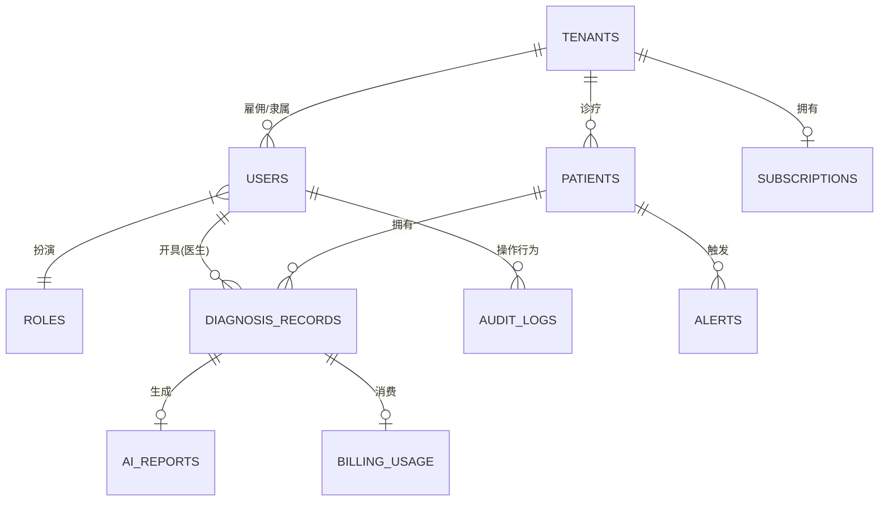

# 慧眼识癌 (2.0) - SaaS级数据库架构规划

当平台从“单机版工具”向“标准 SaaS 平台（多医院/机构接入）”演进时，数据之间的隔离性、权限安全、计费扩展以及追踪留痕变得至关重要。

以下是将现有的双表核心（[users](file:///d:/huiyanshiai%282.0%29/api/database.py#148-155), [patients](file:///d:/huiyanshiai%282.0%29/api/database.py#157-159)）扩展为千万级 SaaS 架构的剖析与规划。

---

## 一、 核心架构理念

1. **多租户隔离 (Multi-tenancy)**：以“医院/机构”为单位进行数据隔离，A 医院的医生绝对无法跨越权限看到 B 医院的患者数据（即便他们在同一张数据库表里）。
2. **RBAC 权限模型 (Role-Based Access Control)**：不仅区分普通用户和管理员，需要精细化为：超级管理员（我们）、院级管理员、主治医生、普通患者。
3. **计费与限制分离**：AI 推理和 DeepSeek 润色需要耗费算力及 Token 成本，必须有专门的用量审计表。
4. **历史快照与实时流**：患者每次上传的数据不应该覆盖，而是形成时间序列以做趋势预警。

---

## 二、 实体关系图 (ER Diagram)

以下是 SaaS 架构的核心表关系拓扑：

---

## 三、 核心模块拆解与表结构规划

### 1. 机构/多租户模块 (Tenant Management)
所有业务数据的基石，通过 `tenant_id` 实现物理表级别的逻辑隔离。

*   **`tenants` (租户/医院表)**
    *   [id](file:///d:/huiyanshiai%282.0%29/api/database.py#119-121): 机构唯一标识
    *   [name](file:///d:/huiyanshiai%282.0%29/api/database.py#116-118): 机构名称（如：北京协和医院）
    *   `region`: 所属大区/私有化节点标识
    *   [status](file:///d:/huiyanshiai%282.0%29/backend/utils.py#98-102): active / suspended（欠费停用）

*   **`subscriptions` (订阅计费表)**
    *   `tenant_id`: 关联医院
    *   `plan_type`: basic / pro / enterprise
    *   `ai_credits_limit`: 每月 AI 生成报告额度上限
    *   `ai_credits_used`: 已用额度（触发限制）

### 2. 用户与权限模块 (RBAC Security)
重构原有的 [users](file:///d:/huiyanshiai%282.0%29/api/database.py#148-155) 表，切分“身份”与“患者本尊”。

*   **[users](file:///d:/huiyanshiai%282.0%29/api/database.py#148-155) (系统账号表 - 医生/管理员)**
    *   [id](file:///d:/huiyanshiai%282.0%29/api/database.py#119-121), [username](file:///d:/huiyanshiai%282.0%29/api/database.py#116-118), `password_hash`, `email`, `phone`
    *   `tenant_id`: 所属医院（系统超级管理员该字段为空）
    *   `role_id`: 关联权限等级

*   **`roles` & `permissions` (角色权限字典表)**
    *   定义谁能查看报表、谁能录入数据、谁能审批。

### 3. 核心医疗与诊断模块 (Clinical Data)
将原来的 [patients](file:///d:/huiyanshiai%282.0%29/api/database.py#157-159) 拆分为**患者档案**与**就诊记录集**，支持一位患者多次来院检测。

*   **[patients](file:///d:/huiyanshiai%282.0%29/api/database.py#157-159) (患者主档案)**
    *   [id](file:///d:/huiyanshiai%282.0%29/api/database.py#119-121), `tenant_id` (归属医院)
    *   [name](file:///d:/huiyanshiai%282.0%29/api/database.py#116-118), `id_card` (加密存储的身份证号), [gender](file:///d:/huiyanshiai%282.0%29/backend/utils.py#103-106), `dob` (出生年月)
    *   `emergency_contact`: 紧急联系人
    
*   **`diagnosis_records` (诊断/筛查记录表)** —— *(相当于目前的 patients 表演进版)*
    *   [id](file:///d:/huiyanshiai%282.0%29/api/database.py#119-121)
    *   `patient_id`: 关联患者
    *   `doctor_id`: 开具此诊断的医生 (关联 `users.id`)
    *   `mean_radius`, `mean_texture`... (各项脱敏生理指标)
    *   `source`: 设备直连导入 / 医生手工录入 / 患者自主上传

### 4. AI 报告与预警系统 (AI & Alerts)
将 AI 的预测和润色结果独立开来，便于后期版本升级或重新生成。

*   **`ai_reports` (AI分析报告表)**
    *   `record_id`: 关联哪次诊断
    *   `model_version`: 运行时的算法版本 (如 `rf_v2.1`，排查医疗事故必须要有追溯)
    *   `diagnosis`, [probability](file:///d:/huiyanshiai%282.0%29/models/simulated_model.py#4-17), [risk_level](file:///d:/huiyanshiai%282.0%29/models/simulated_model.py#18-26)
    *   `deepseek_summary`, `deepseek_suggestions`: 大语言模型润色的医嘱

*   **`alerts` (实时预警与监控表)**
    *   `patient_id`
    *   `alert_type`: `HIGH_RISK_DETECTED` (突发高危) / `DATA_ANOMALY` (机器异常数据)
    *   [status](file:///d:/huiyanshiai%282.0%29/backend/utils.py#98-102): unread / acknowledged / resolved
    *   `triggered_at`: 告警触发时间
    *   *功能场景*：患者在手机端上传体检单，若某项指标飙升，直接通过小程序/短消息通知对应的全科主治医生。

### 5. 审计与履历 (Audit Trails - 医疗合规刚需)
所有改动必须留痕，这是 SaaS 平台尤其是医疗系统过等保（等级保护）的底线。

*   **`audit_logs` (审计日志表)**
    *   [user_id](file:///d:/huiyanshiai%282.0%29/api/database.py#169-171): 谁做的
    *   `action`: 做了什么 (如 `VIEW_PATIENT`, `MODIFY_REPORT`, `EXPORT_DATA`)
    *   `ip_address`, `device_info`
    *   `timestamp`: 发生时间

---

## 四、 架构演进路线图 (Roadmap)

考虑到我们目前是 **2.0 MVP 阶段**，不能一口气吃成胖子。建议的演进路径如下：

- [ ] **Phase 0 (基础设施演进)**：前期利用 **Supabase** (PostgreSQL) 快速跑通 SaaS 多租户模型与云端数据库交互；随着业务扩大或合规要求提高，通过导表或同步工具，无缝迁移至**自己的私人服务器或阿里云全托管 PostgreSQL**（代码层通过更改 `DATABASE_URL` 即可零成本切换）。
- [ ] **Phase 1 (数据隔离)**：在目前的 SQLAlchemy 架构上，优先增加 `tenant_id` 和隔离层中间件。让不同诊所注册后，看到的只是自己的数据。
- [ ] **Phase 2 (近期)**：剥离 `Diagnosis` 表，支持一人多次检测，用 Echarts 生成健康趋势折线图。
- [ ] **Phase 3 (未来)**：引入 Redis (缓存高速读取与限流) + Celery/RabbitMQ (异步生成深度报告，不阻塞页面)。
- [ ] **Phase 4 (全 SaaS)**：重构路由层，支持子域名访问 (如 `xiehe.huiyanshiai.com`)。
